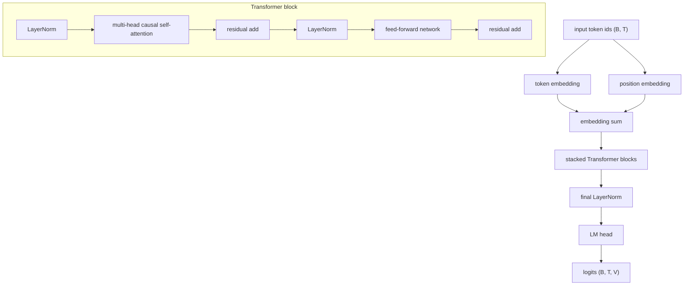

# ECO4126 Tiny GPT 한국어 문자 모델

## 프로젝트 개요

이 프로젝트는 PyTorch로 작은 한국어 문자 단위 GPT를 직접 구현하고 학습하는 최종 프로젝트이다. 목표는 거대한 사전학습 모델을 만드는 것이 아니라, 다음 문자 예측 문제를 통해 GPT 구조의 핵심 요소를 작게 재현하는 것이다.

Tiny Shakespeare나 저작권이 있는 소설은 사용하지 않았다. 데이터는 `data/korean_finance_corpus.txt`에 직접 작성한 한국어 문장으로 구성했으며, 주제는 인공지능, 금융, 시장, 교육, 책임 있는 기술이다.

## 노트북

- [Notebook 01 Bigram](notebooks/01_bigram.ipynb)
- [Notebook 02 Embedding + MLP](notebooks/02_mlp_embedding.ipynb)
- [Notebook 03 Korean Corpus MLP](notebooks/03_korean_corpus_mlp.ipynb)
- [Notebook 04 Sequence LM](notebooks/04_sequence_lm.ipynb)
- [Notebook 05 Masked Attention](notebooks/05_masked_attention.ipynb)
- [Notebook 06 Tiny GPT Korean](notebooks/06_tiny_gpt_korean.ipynb)

## 학습 진행 흐름

1. Bigram Language Model: 현재 문자 하나만 보고 다음 문자를 예측한다.
2. Embedding + MLP character model: 여러 문자 문맥을 임베딩하고 작은 MLP로 다음 문자를 예측한다.
3. GPT-style sequence dataset: `block_size` 길이의 입력 `x`와 한 칸 이동한 목표 `y`를 만든다.
4. Single-head causal masked self-attention: 한 어텐션 헤드가 과거 위치만 보도록 causal mask를 적용한다.
5. Multi-head Tiny GPT: 여러 어텐션 헤드, 피드포워드 네트워크, 잔차 연결, LayerNorm, dropout, Transformer block을 쌓아 최종 모델을 만든다.

## 단계 비교

| stage | context size | model | attention | output shape | key limitation |
|---|---:|---|---|---|---|
| 01 Bigram | 1 | embedding table | 없음 | `(B, V)` | 직전 문자 하나만 사용 |
| 02 MLP | 3 | token embedding + flatten + MLP | 없음 | `(B, V)` | 고정 길이 문맥만 사용 |
| 03 Corpus MLP | 3 | 한국어 말뭉치 MLP | 없음 | `(B, V)` | 긴 도메인 문맥을 잃음 |
| 04 Sequence LM | `T` | token + positional embedding + FFN | 없음 | `(B, T, V)` | 위치 간 정보 교환 없음 |
| 05 Masked Attention | `T` | single-head masked self-attention | causal | `(B, T, H)` | 단일 head와 블록 부재 |
| 06 Tiny GPT | 64 | stacked Transformer blocks | multi-head causal | `(B, T, V)` | 작은 말뭉치로 과적합 |

## 모델 구조



최종 Tiny GPT는 token embedding, positional embedding, causal masked self-attention, multi-head attention, feed-forward network, residual connections, LayerNorm, dropout, stacked Transformer blocks, final LayerNorm, LM head를 포함한다.

## 핵심 개념

어휘 vocabulary는 말뭉치에 등장하는 모든 고유 문자의 집합이다. `stoi`는 character to integer 표이고, `itos`는 integer to character 표이다. 문자 단위 토크나이저는 한국어 글자, 공백, 문장부호를 각각 하나의 토큰으로 다룬다.

`block_size`는 모델이 한 번에 보는 최대 문맥 길이이다. 데이터셋은 길이 `block_size + 1`의 조각을 잡은 뒤 앞부분을 `x`, 한 칸 뒤로 밀린 뒷부분을 `y`로 만든다. 예를 들어 `[0, 1, 2, 3]`에서 `block_size=3`이면 `x=[0,1,2]`, `y=[1,2,3]`이다.

모델 출력 `logits`의 shape은 `(B, T, V)`이다. `B`는 batch size, `T`는 sequence length, `V`는 vocabulary size이다. target shape은 `(B, T)`이며 각 위치의 정답 토큰 id를 담는다. sequence cross entropy는 `(B*T, V)`로 펼친 logits와 `(B*T)`로 펼친 target을 비교해 모든 위치의 평균 손실을 계산한다.

어텐션에서 Q는 query, K는 key, V는 value이다. Q와 K의 내적으로 위치 간 관련도를 계산하고, head dimension의 제곱근으로 나누어 attention scaling을 적용한다. causal mask는 미래 위치를 보지 못하게 막아 다음 토큰 예측 규칙을 지킨다.

생성에서는 마지막 위치의 logits를 확률분포로 바꾸어 다음 문자를 샘플링한다. temperature가 낮으면 더 보수적인 문자가 선택되고, 높으면 더 다양한 문자가 선택된다. top-k sampling은 확률이 높은 상위 k개 후보만 남겨 불안정한 생성을 줄인다.

## 학습 설정

기본 quick 학습 설정은 GitHub Codespaces CPU에서 돌아가도록 작게 잡았다.

- `block_size`: 64
- `n_embd`: 96
- `n_head`: 4
- `n_layer`: 3
- `dropout`: 0.1
- `batch_size`: 32
- `max_iters`: 120 for `--quick`
- `seed`: 42
- `optimizer`: AdamW
- `learning_rate`: 0.003

## 학습 결과

학습 로그는 `outputs/training_history.csv`에 저장된다. 손실 곡선은 아래 파일로 저장된다.

- initial train/val loss: `6.0947 / 6.0954`
- final train/val loss: `1.1248 / 3.8742`

train loss는 크게 내려갔지만 validation loss는 중간 이후 다시 높아졌다. 이는 말뭉치가 작아서 모델이 학습 문장을 빠르게 외우는 과적합 신호로 보는 것이 정직하다.


생성 샘플은 `outputs/generated_samples.txt`에 저장된다. 짧은 학습이므로 문장이 완벽하지는 않지만, 한국어 문자 패턴과 프로젝트 말뭉치의 주제 표현을 학습하는 흐름을 확인할 수 있다.

```text
인공지능, 책임 금융, 기술에 가장, 반응한 심리로 기록 연결정수로 수익률만 있다.

따라 인공지능에서 있는 금융, 때는 때는 때로 책임베딩은 기술은 반응한 아니라 기업의 위치의 문자동하지며 네트워크와 문제와 가질의 더 글자가중요약할 완벽한다.
인과 글자 위치와 인공지능을 글자 제이 글자 글자동성을 정합한다.
금융 문자 조정을 목표이상하지만 완벽한한 높으면 한 문자 문자에 없어 학습하지만 문자의 칸 문맥을 학습한다.
```

## 재현 명령어

```bash
python -m pip install -r requirements.txt
python -m unittest discover -s tests -v
python -m src.train --quick
python -m src.generate
```

## 한계

말뭉치가 작기 때문에 생성 문장의 사실성, 긴 문맥 유지, 금융 지식의 정확성은 제한적이다. 문자 단위 토큰화는 구현이 단순하지만 단어 의미를 효율적으로 표현하지 못한다. 이 모델은 교육용 구조 실험이며 투자 판단이나 금융 조언에 사용할 수 없다.

## 파일 구조

```text
README.md
requirements.txt
data/korean_finance_corpus.txt
notebooks/06_tiny_gpt_korean.ipynb
notebooks/01_bigram.ipynb
notebooks/02_mlp_embedding.ipynb
notebooks/03_korean_corpus_mlp.ipynb
notebooks/04_sequence_lm.ipynb
notebooks/05_masked_attention.ipynb
src/__init__.py
src/baselines.py
src/tokenizer.py
src/dataset.py
src/model.py
src/train.py
src/generate.py
outputs/training_history.csv
outputs/loss_curve.png
outputs/generated_samples.txt
outputs/model_config.json
tests/test_tokenizer.py
tests/test_model.py
tests/test_dataset.py
tests/test_baselines.py
```
