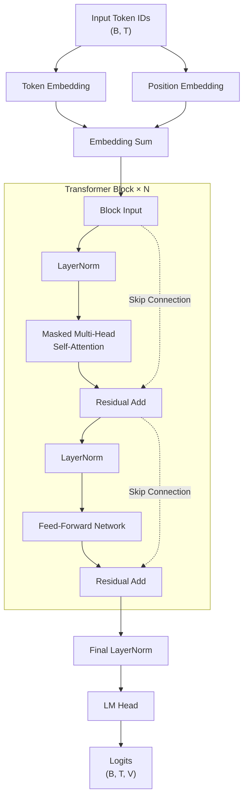
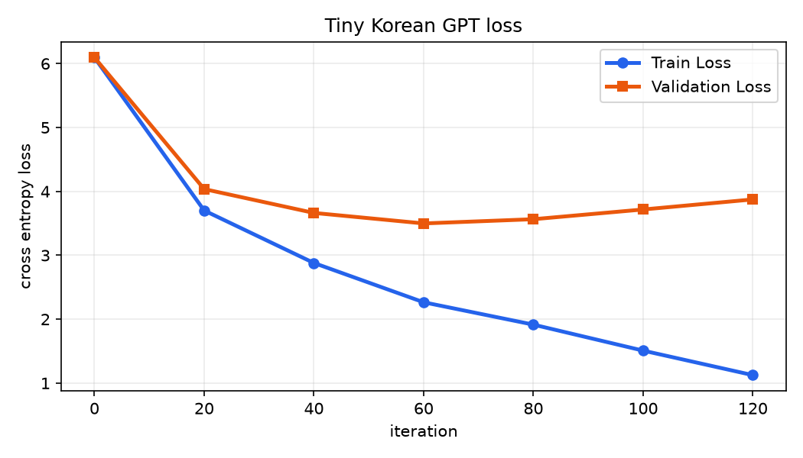

# ECO4126 TinyGPT 한국어 문자 언어 모델

이 저장소는 PyTorch로 작은 문자 단위 한국어 TinyGPT를 구현하고, 직접 작성한 금융·인공지능 말뭉치로 짧은 학습을 수행한 기술 프로젝트입니다. `course_notebooks/`에는 강의 원본 노트북이 보존되어 있으며, `notebooks/06_tiny_gpt_korean.ipynb`에는 한국어 TinyGPT 최종 노트북이 정리되어 있습니다.

## 목차

1. [저장소 개요](#저장소-개요)
2. [강의 학습 흐름](#강의-학습-흐름)
3. [한국어 TinyGPT 프로젝트](#한국어-tinygpt-프로젝트)
4. [Tiny GPT 구조](#tiny-gpt-구조)
5. [핵심 개념](#핵심-개념)
6. [학습 설정](#학습-설정)
7. [실제 학습 결과](#실제-학습-결과)
8. [생성 샘플](#생성-샘플)
9. [학습 결과 분석](#학습-결과-분석)
10. [테스트와 재현 명령어](#테스트와-재현-명령어)
11. [파일 구조](#파일-구조)

## 저장소 개요

| 구분 | 경로 | 설명 |
|---|---|---|
| 강의 원본 노트북 | `course_notebooks/notebook_01.ipynb` - `course_notebooks/notebook_06.ipynb` | 강의에서 제공된 원본 노트북이며, 변경하지 않고 보존했습니다. |
| 한국어 TinyGPT 최종 노트북 | [notebooks/06_tiny_gpt_korean.ipynb](notebooks/06_tiny_gpt_korean.ipynb) | 직접 작성한 한국어 말뭉치로 TinyGPT를 학습하고 결과를 정리한 중심 노트북입니다. |
| 한국어 단계별 재구현 노트북 | [notebooks/01_bigram.ipynb](notebooks/01_bigram.ipynb) - [notebooks/05_masked_attention.ipynb](notebooks/05_masked_attention.ipynb) | 강의 흐름을 한국어 데이터로 짧게 재현한 보조 실험 노트북입니다. |
| 소스 코드 | `src/` | tokenizer, dataset, baseline models, TinyGPT model, train/generate scripts를 포함합니다. |
| 결과물 | `outputs/` | 학습 로그, 손실 곡선, checkpoint, model config, 생성 샘플을 포함합니다. |
| 테스트 | `tests/` | tokenizer, dataset, baseline, model shape, generation shape 테스트를 포함합니다. |

## 강의 학습 흐름

| 단계 | 강의 원본 노트북 | 핵심 내용 |
|---|---|---|
| 1 | [notebook_01.ipynb](course_notebooks/notebook_01.ipynb) | Bigram 모델은 현재 문자 하나만 보고 다음 문자를 예측합니다. 가장 단순하지만 긴 문맥을 기억하지 못합니다. |
| 2 | [notebook_02.ipynb](course_notebooks/notebook_02.ipynb) | Embedding + MLP는 짧은 고정 길이 문맥을 벡터로 바꾸고, flatten 후 MLP로 다음 문자를 예측합니다. |
| 3 | [notebook_03.ipynb](course_notebooks/notebook_03.ipynb) | 긴 텍스트 MLP는 더 긴 텍스트에서 sliding window로 많은 학습 예제를 만들지만, 고정 문맥 한계를 유지합니다. |
| 4 | [notebook_04.ipynb](course_notebooks/notebook_04.ipynb) | sequence language model은 `x/y` shifted sequence를 사용해 모든 위치에서 다음 토큰을 예측합니다. |
| 5 | [notebook_05.ipynb](course_notebooks/notebook_05.ipynb) | single-head masked attention은 Q, K, V와 causal mask로 과거 위치만 읽습니다. |
| 6 | [notebook_06.ipynb](course_notebooks/notebook_06.ipynb) | multi-head Tiny GPT는 여러 attention head와 Transformer block을 쌓아 최종 언어 모델 구조를 만듭니다. |

| 단계 | 문맥 길이 | 모델 | 어텐션 | 출력 형태 | 핵심 한계 |
|---|---:|---|---|---|---|
| Bigram | 1 | embedding table | 없음 | `(B, V)` | 직전 문자 하나만 사용합니다. |
| Embedding + MLP | fixed small window | token embedding + flatten + MLP | 없음 | `(B, V)` | 고정 길이 문맥만 사용합니다. |
| 긴 텍스트 MLP | fixed window | sliding-window MLP | 없음 | `(B, V)` | 긴 텍스트의 장거리 문맥을 잃습니다. |
| sequence LM | `T` | token + positional embedding | 없음 | `(B, T, V)` | 위치 간 정보 교환이 없습니다. |
| masked attention | `T` | single-head self-attention | causal | `(B, T, H)` | 단일 head와 Transformer block이 없습니다. |
| Tiny GPT | 64 | stacked Transformer blocks | multi-head causal | `(B, T, V)` | 작은 말뭉치에서는 과적합이 발생할 수 있습니다. |

## 한국어 TinyGPT 프로젝트

한국어 TinyGPT 최종 노트북은 [notebooks/06_tiny_gpt_korean.ipynb](notebooks/06_tiny_gpt_korean.ipynb)입니다. 이 프로젝트는 Tiny Shakespeare를 사용하지 않았으며, 저작권이 있는 소설도 사용하지 않았습니다.

학습 데이터는 [data/korean_finance_corpus.txt](data/korean_finance_corpus.txt)에 직접 작성한 한국어 문장으로 구성했습니다. 주제는 인공지능, 금융 시장, 투자 위험, 교육, 책임 있는 기술, 설명 가능성, 데이터 편향입니다. 데이터 규모는 작지만 문자 단위 tokenizer, next-token prediction, causal attention, Transformer block의 학습 흐름을 확인하기에 적합하도록 구성했습니다.

## Tiny GPT 구조



최종 모델은 token embedding, positional embedding, causal masked self-attention, multi-head attention, feed-forward network, residual connection, LayerNorm, dropout, stacked Transformer blocks, final LayerNorm, LM head를 포함합니다.

## 핵심 개념

| 개념 | 설명 |
|---|---|
| vocabulary | 말뭉치에 등장하는 모든 고유 문자 집합입니다. 한국어 글자, 공백, 문장부호가 모두 문자 토큰이 됩니다. |
| `stoi`, `itos` | `stoi`는 문자를 정수 id로 바꾸는 dictionary이고, `itos`는 정수 id를 문자로 되돌리는 dictionary입니다. |
| `block_size` | 모델이 한 번에 볼 수 있는 최대 문맥 길이입니다. 최종 실험에서는 `64`를 사용했습니다. |
| `x/y` shifting | `x`는 현재 문맥이고 `y`는 한 칸 뒤로 이동한 다음 문자 정답입니다. 예: `x=[0,1,2]`, `y=[1,2,3]`. |
| logits `(B,T,V)` | batch `B`, sequence length `T`, vocabulary size `V`에 대한 다음 토큰 점수입니다. |
| targets `(B,T)` | 각 batch와 time 위치의 정답 토큰 id입니다. |
| sequence cross entropy | logits를 `(B*T,V)`, targets를 `(B*T)`로 펼쳐 모든 위치의 평균 next-token loss를 계산합니다. |
| Q, K, V | Query는 현재 위치가 찾는 정보, Key는 각 위치의 주소, Value는 실제로 섞이는 내용입니다. |
| scaled dot-product attention | `Q @ K.T / sqrt(head_size)`로 attention score를 계산하고 softmax로 가중치를 만듭니다. |
| causal mask | lower-triangular mask로 미래 위치를 가려 다음 토큰 예측에서 정답을 미리 보지 못하게 합니다. |
| multi-head attention | 여러 attention head가 서로 다른 표현 공간에서 과거 문맥을 읽고 결과를 합칩니다. |
| residual connection | block 입력을 attention/FFN 출력에 더해 깊은 네트워크의 학습을 안정화합니다. |
| LayerNorm | 각 위치의 hidden representation을 정규화해 학습을 안정화합니다. |
| dropout, FFN | dropout은 과적합을 줄이고, FFN은 attention 이후 각 위치의 표현을 비선형으로 변환합니다. |
| temperature, top-k | temperature는 샘플링 분포의 날카로움을 조절하고, top-k는 확률 상위 k개 후보만 남겨 생성 안정성을 높입니다. |

## 학습 설정

| 항목 | 값 |
|---|---:|
| framework | PyTorch |
| tokenizer | character-level Korean tokenizer |
| data | `data/korean_finance_corpus.txt` |
| `block_size` | 64 |
| `n_embd` | 96 |
| `n_head` | 4 |
| `n_layer` | 3 |
| `dropout` | 0.1 |
| `batch_size` | 32 |
| `max_iters` | 120 (`--quick`) |
| optimizer | AdamW |
| learning rate | 0.003 |
| seed | 42 |
| device | CPU-safe quick run |

## 실제 학습 결과

| metric | value |
|---|---:|
| initial train loss | 6.0947 |
| initial validation loss | 6.0954 |
| final train loss | 1.1248 |
| final validation loss | 3.8742 |



## 생성 샘플

아래 텍스트는 [outputs/generated_samples.txt](outputs/generated_samples.txt)에 저장된 실제 생성 결과입니다.

```text
인공지능을 때로 수익률만 강조하지 강조하지 한다.
학교육에서 모델은 학습 문자 배우 작은 문자의 도 도 원리에 만 틀릴 수적용하지만 함께 데이터셋 있다.
학습하지능을 문장을 문맥스이터를 문장에서 문맥을 없애지 작은 완벽한다.
모델을 문자 예측과거의 문장은 문맥을 학습한다.

학습한다.
시장을 인공지만 학교에서 예를 문맥을 모델은 완벽한다.
그래서와 학습과 문자 그럴듯해 모델은 학습 펼쳐 토큰 펼쳐 토큰화이 문자의 학습 단일은 토를 경망으로 중요약할 토크를 문제와 줄여 경망, 줄여 줄인과 함과 점수준을 확인다.
따라서 문자 벡터로 배워크들고
```

## 학습 결과 분석

훈련 손실은 `6.0947`에서 `1.1248`로 감소하여, 모델이 한국어 말뭉치의 문자 전이와 지역적인 문맥 패턴을 학습했음을 확인했습니다. 검증 손실은 초기 `6.0954`에서 `3.4987`까지 감소한 뒤 최종 `3.8742`로 다시 상승했습니다. 이는 제한된 규모의 말뭉치에서 학습이 진행되면서 훈련 데이터에 대한 적합도가 일반화 성능보다 빠르게 높아진 과적합 현상으로 해석할 수 있습니다.

본 프로젝트의 목표는 한국어 문자 단위 데이터에서 TinyGPT 구조를 직접 구현하고, 실제 학습과 문장 생성 과정을 검증하는 것이었습니다. 손실 감소, 손실 곡선, 생성 결과를 통해 해당 목표를 확인했습니다. 더 큰 말뭉치, early stopping, 정규화 강화, subword tokenization은 후속 확장 실험에서 적용할 수 있습니다.

## 테스트와 재현 명령어

이미 의존성이 설치된 환경에서는 다음 명령어로 검증할 수 있습니다.

```bash
python -m compileall src
python -m unittest discover -s tests -v
python -m src.generate
```

처음 환경을 구성하는 경우에는 아래 명령어로 의존성을 설치한 뒤 실행합니다.

```bash
python -m pip install -r requirements.txt
python -m src.train --quick
python -m src.generate
```

노트북 실행 검증은 한국어 단계별 재구현 노트북과 한국어 TinyGPT 최종 노트북에 대해 수행합니다. 강의 원본 노트북은 JSON 유효성만 확인하고 수정하지 않습니다.

## 파일 구조

```text
README.md
requirements.txt
course_notebooks/
  README.md
  notebook_01.ipynb
  notebook_02.ipynb
  notebook_03.ipynb
  notebook_04.ipynb
  notebook_05.ipynb
  notebook_06.ipynb
data/
  korean_finance_corpus.txt
notebooks/
  01_bigram.ipynb
  02_mlp_embedding.ipynb
  03_korean_corpus_mlp.ipynb
  04_sequence_lm.ipynb
  05_masked_attention.ipynb
  06_tiny_gpt_korean.ipynb
src/
  __init__.py
  baselines.py
  tokenizer.py
  dataset.py
  model.py
  train.py
  generate.py
outputs/
  training_history.csv
  loss_curve.png
  generated_samples.txt
  model_config.json
  tiny_gpt.pt
tests/
  test_baselines.py
  test_tokenizer.py
  test_dataset.py
  test_model.py
```
